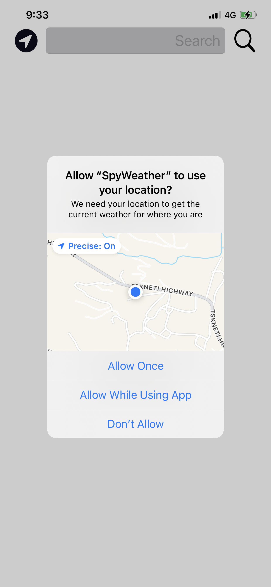

# SpyWeather 
## Created by Giorgi Samkharadze
---
**SpyWeather is an application that generates current weather and time of the city.**


I made this app using two apis one for weather and second  for world time. world time api request is made with weather api properties longitude and latitude and than it generates the current time.

---
## Weather API 
[openweathermap](https://openweathermap.org/api)
## Time API
[timeapi.io](https://timeapi.io/swagger/index.html)

---
### when starting app it requests you location to show weather and time by your location




---
# Video of an app


___
I made this app using Swift and UIKit. If you want to test or try my app simply clone the project :)
```bash
cd /where/you/want/

git clone 

```
---


## Basic info about me

| Name   | Email     | Phone  |
| ------ |  -----    | ------ |
| Giorgi Samkharadze | gsamkharadze51@gmail.com | + 995 599 06 40 03
